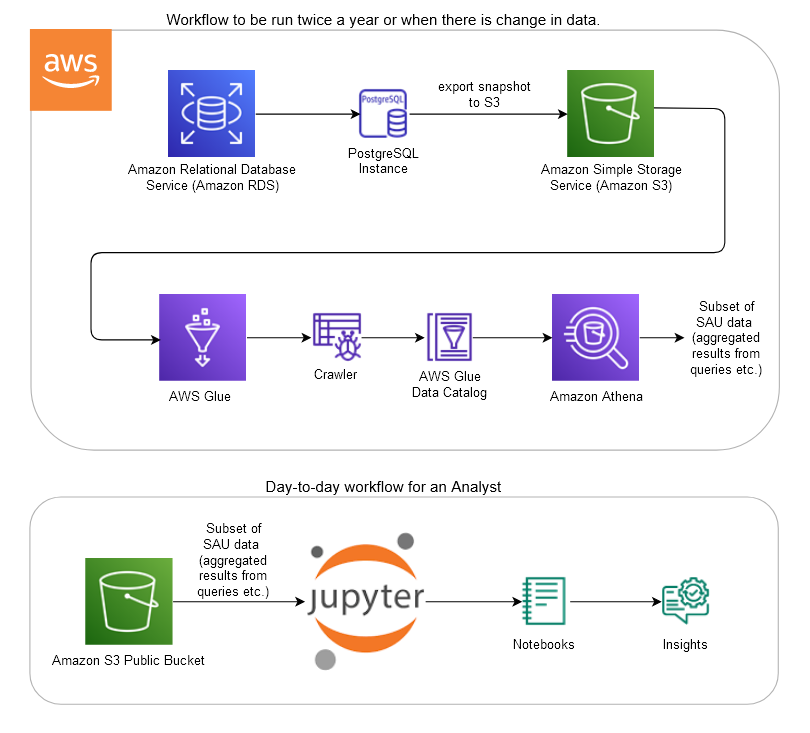

# Sea Around Us

## Project Overview

The [Sea Around Us](http://www.seaaroundus.org/) is an international research initiative at the University of British Columbia, which acts as a critical resource to assess the impact of fisheries on marine environments. The Sea Around Us seeks to improve data access to enhance the meaningful analysis and research through the website and broaden the impact of this important dataset.

To improve data access for researchers requesting large datasets, results of certain queries from the SAU database are exposed in Amazon S3 and are accessible through Jupyter notebooks. This enables power users to do more in depth analysis on the SAU dataset and also visualize results as needed. The proposed solution involves AWS services such as RDS, Glue, Athena, and S3.

First, the snapshot of the Sea Around Us PostgreSQL database (filtered to only the necessary tables) is exported to S3. Then the metadata of this data is captured with the help from Glue crawlers. The data in S3 is now ready to be queried from Athena in a server-less fashion. When the queries are run on Athena, CSV files are automatically generated in relevant folders on S3. These CSV files can now be loaded into Jupyter notebooks in any environment for further analysis, visualizations, and for generating insights from data.

## High level Architecture Diagram

## User Guides

Documentation for different steps involved in this project is added in individual user guides in the docs folder of this repository.

## Example Notebooks

Jupyter notebooks that include different data analysis, visualizations, and data access scenarios are included in notebooks folder of this repository.

## License

This project is distributed under [MIT License](https://github.com/UBC-CIC/Sea-Around-Us/blob/main/LICENSE).

